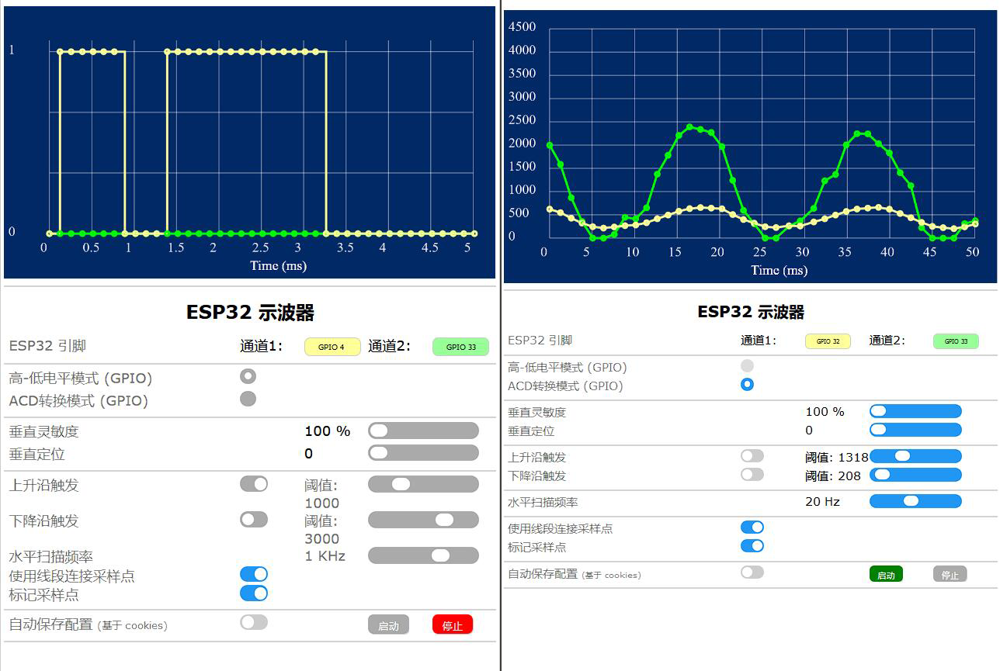

# 基于ESP32的网页示波器

**原项目演示网页 [http://193.77.159.208/oscilloscope.html](http://193.77.159.208/oscilloscope.html).**

第一幅图是GPIO串联电阻之后碰触VCC触发的波形；第二个图是手指触碰GPIO出现的感应电波形。





Esp32 oscilloscope takes approximately 40 samples per screen but the sampling rate may not be completely constant all the time since there are other processes, (beside the sampling process itself, especially if you are using Esp32 oscilloscope as a part of your project, not as a standalone solution) running at the same time. Esp32 oscilloscope displays the samples as they were taken and not the signal as it is on its input pins. The samples are represented whether by digital values 0 and 1 or analog values from 0 to 4095 which correspond to 0 V to 3.3 V.

You are welcome to modify oscilloscope.html to match your needs, meaning, specify which GPIOs are actually used as digital inputs and which as analog inputs, to make some sense of what signals you are monitoring.

ESP32 oscilloscope was first meant to be just a demonstration of the ESP32_web_ftp_telnet_server_template (https://github.com/BojanJurca/Esp32_web_ftp_telnet_server_template) capabilities and is still fully included there, but it seems to be
better off on its own. Only functionalities necessary for oscilloscope to work are used here.


## What is new in version 2.0?

Honestly, not much, only only a new version, 2.0 of servers is used with improved performance, efficiency and stability.


## Setup instructions

1. Copy all files in this package to Esp32_oscilloscope directory.
2. Open Esp32_oscilloscope.ino with Arduino IDE.
3. Find and change YOUR-STA-SSID to your WiFi SSID and YOUR-STA-PASSWORD to your WiFi password.
4. Oscilloscope uses FAT file system so select one of FATFS partition schemas (Tools | Partition scheme | ...)
5. Compile sketch and run it on your ESP32 for the first time. Doing this, ESP32 flash memory will be formatted with FAT file system. WARNING: every information you have stored into ESP32’s flash memory will be lost.
6. FTP to your ESP32 (By using ftp command line utility or Windows explorer. User name and password are not required) and upload the following files into /var/www/html directory:

   - android-192-osc.png,
   - apple-180-osc.png,
   - oscilloscope.html.

```
C:\esp32_oscilloscope>ftp YOUR-ESP32-IP
Connected to 10.0.0.3.
220-ESP32 FTP server - everyone is allowed to login
User (10.0.0.3:(none)):
331 enter password
Password:
230 logged on, use "/" to refer to your home directory "/"
ftp> put android-192-osc.png /var/www/html/android-192.png
226 /var/www/html/android-192-osc.png transfer complete
ftp> put apple-180-osc.png /var/www/html/apple-180.png
226 /var/www/html/apple-180-osc.png transfer complete
ftp> put oscilloscope.html /var/www/html/oscilloscope.html
226 /var/www/html/oscilloscope.html transfer complete
ftp> ls
200 port ok
150 starting transfer
-r-xr-xrwx   1 owner    group            1818 Aug 24 10:47      /var/www/html/android-192-osc.png
-r-xr-xrwx   1 owner    group            1596 Aug 24 10:47      /var/www/html/apple-180-osc.png
-r-xr-xrwx   1 owner    group           39515 Aug 24 10:47      /var/www/html/oscilloscope.html
226 transfer complete
ftp>
```

6. Open http://YOUR-ESP32-IP/oscilloscope.html with your browser.


## Things to consider when analogReading GPIOs


ESP32 has two SARs (Successive Approximation Registers) built-in among which only ADC1 (GPIOs: 36, 37, 38, 39, 32, 33, 34, 35) can be used for oscilloscope analogReadings. ADC2 (GPIOs: 4, 0, 2, 15, 13, 12, 14, 27, 25, 26) can perform analogReadings only when WiFi is not working. Since oscilloscope uses WiFi, ADC2 GPIOs are not available at this time.

ESP32 functions that perform ADC conversion (adc1_get_raw or Arduino analogRead for example) are not thread safe. If your sketch is analogReading ADC1 GPIOs then you are not supposed to use oscilloscope on these GPIOs. If you must, you can use adc () function (from oscilloscope.h) instead of adc1_get_raw () or do your own reading inside critical section like oscilloscope does:

```C++
inline int16_t adc (adc1_channel_t channel) __attribute__((always_inline));
int16_t adc (adc1_channel_t channel) {
  taskENTER_CRITICAL (&analogReadMutex);
    int i = adc1_get_raw (channel);
  taskEXIT_CRITICAL (&analogReadMutex);
  return i;
}
```

Since IDF 4.? you can no longer analogRead GPIOs that generate analog output themselves. You may have to use a wire to connect GPIO used for analog output to GPIO used for ADC conversion and read the signal there.
